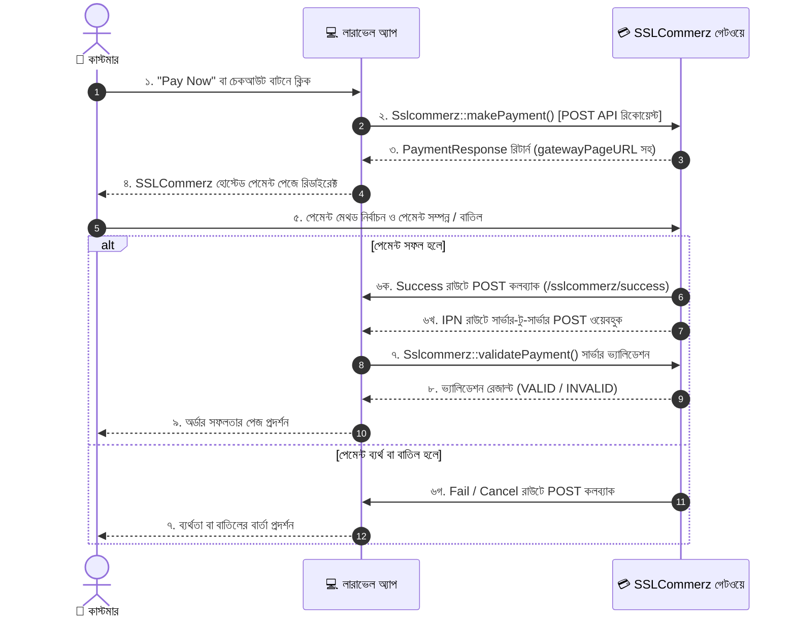

# ব্যবহার ও কাজের ধারা (Basic Usage)

[English Guide](../en/02-basic-usage.md) | **বাংলা গাইড**

এই নির্দেশিকায় কলব্যাক রাউট নির্ধারণ, CSRF এক্সেম্পশন সেটআপ, পেমেন্ট রিকোয়েস্ট তৈরি এবং রেসপন্স হ্যান্ডেল করার নিয়ম বিস্তারিতভাবে আলোচনা করা হয়েছে।

---

## 🔄 পেমেন্ট লাইফসাইকেল ওভারভিউ (Payment Lifecycle)

লারাভেল অ্যাপ্লিকেশনে SSLCommerz পেমেন্ট গেটওয়ের কাজের ধাপগুলো নিচের সিকোয়েন্স ডায়াগ্রামে দেখানো হলো:



---

## 🛣️ ধাপ ১: কলব্যাক রাউট নির্ধারণ করা

SSLCommerz-এ পেমেন্ট সম্পন্ন, ব্যর্থ বা বাতিল হওয়ার পর কাস্টমারকে আপনার ওয়েবসাইটে ফেরত পাঠানোর জন্য এবং সার্ভার-টু-সার্ভার ইনস্ট্যান্ট পেমেন্ট নোটিফিকেশন (IPN) গ্রহণের জন্য রাউট তৈরি করতে হবে।

`routes/web.php` ফাইলে নিচের রাউটগুলো যোগ করুন:

```php
use App\Http\Controllers\SslcommerzPaymentController;
use Illuminate\Support\Facades\Route;

Route::prefix('sslcommerz')
    ->name('sslc.')
    ->controller(SslcommerzPaymentController::class)
    ->group(function () {
        Route::post('success', 'success')->name('success');
        Route::post('failure', 'failure')->name('failure');
        Route::post('cancel', 'cancel')->name('cancel');
        Route::post('ipn', 'ipn')->name('ipn');
    });
```

> [!NOTE]
> এখানে নির্ধারিত রাউট নেইম `sslc.success`, `sslc.failure`, `sslc.cancel` এবং `sslc.ipn` ডিফল্ট কনফিগারেশনের সাথে সামঞ্জস্যপূর্ণ। আপনি যদি কনফিগারেশন ফাইলে নাম পরিবর্তন করেন, তবে রাউট ডেফিনিশনেও সেই অনুযায়ী নাম দিন।

---

## 🛡️ ধাপ ২: CSRF ভেরিফিকেশন এক্সেম্পশন (CSRF Exemption)

SSLCommerz-এর বাহ্যিক POST কলব্যাকগুলোকে CSRF ভেরিফিকেশন থেকে এক্সেম্পট করুন:

### লারাভেল ১৩ (`bootstrap/app.php`)

```php
use Illuminate\Foundation\Application;
use Illuminate\Foundation\Configuration\Middleware;

return Application::configure(basePath: dirname(__DIR__))
    ->withMiddleware(function (Middleware $middleware) {
        $middleware->preventRequestForgery(except: [
            'sslcommerz/*',
        ]);
    })
    ->create();
```

### লারাভেল ১১ ও ১২ (`bootstrap/app.php`)

```php
use Illuminate\Foundation\Application;
use Illuminate\Foundation\Configuration\Middleware;

return Application::configure(basePath: dirname(__DIR__))
    ->withMiddleware(function (Middleware $middleware) {
        $middleware->validateCsrfTokens(except: [
            'sslcommerz/*',
        ]);
    })
    ->create();
```

### লারাভেল ১০ (`app/Http/Middleware/VerifyCsrfToken.php`)

```php
protected $except = [
    'sslcommerz/*',
];
```

---

## 🚀 ধাপ ৩: পেমেন্ট শুরু করা (Initiating Payment)

পেমেন্ট সেশন তৈরি করতে `Sslcommerz` ফ্যাসাড ব্যবহার করুন। অর্ডার, কাস্টমার এবং শিপিং তথ্য চেইনিং করে `makePayment()` মেথড কল করুন:

```php
namespace App\Http\Controllers;

use Illuminate\Http\Request;
use Raziul\Sslcommerz\Facades\Sslcommerz;

class SslcommerzPaymentController extends Controller
{
    public function initiatePayment(Request $request)
    {
        // ১. ইউনিক ইনভয়েস আইডি এবং অর্ডারের বিস্তারিত প্রস্তুত করুন
        $invoiceId = 'INV-' . strtoupper(uniqid());
        $totalAmount = 1250.00;
        $productName = 'Wireless Headphones';
        $productCategory = 'Electronics';

        // ২. পেমেন্ট ইনিশিয়েট করুন
        $response = Sslcommerz::setOrder($totalAmount, $invoiceId, $productName, $productCategory)
            ->setCustomer(
                name: 'করিম রহমান',
                email: 'karim@example.com',
                phone: '01711000000',
                address: 'বাড়ি ১২, রোড ৫, ধানমন্ডি',
                city: 'ঢাকা',
                state: 'ঢাকা',
                postal: '1205',
                country: 'Bangladesh'
            )
            ->setShippingInfo(
                quantity: 1,
                address: 'বাড়ি ১২, রোড ৫, ধানমন্ডি',
                name: 'করিম রহমান',
                city: 'ঢাকা',
                state: 'ঢাকা',
                postal: '1205',
                country: 'Bangladesh'
            )
            ->makePayment();

        // ৩. রেসপন্স হ্যান্ডেল করুন
        if ($response->success()) {
            // আপনার ডাটাবেজে পেন্ডিং অর্ডারটি সংরক্ষণ করুন
            
            // SSLCommerz-এর পেমেন্ট পেজে রিডাইরেক্ট করুন
            return redirect($response->gatewayPageURL());
        }

        // পেমেন্ট শুরু হতে ব্যর্থ হলে
        return back()->with('error', 'পেমেন্ট শুরু করা সম্ভব হয়নি: ' . $response->failedReason());
    }
}
```

---

## 📥 ধাপ ৪: কলব্যাক রেসপন্স হ্যান্ডেল করা

আপনার কন্ট্রোলারে প্রতিটি কলব্যাকের মেথড বাস্তবায়ন করুন:

```php
namespace App\Http\Controllers;

use Illuminate\Http\Request;
use Raziul\Sslcommerz\Facades\Sslcommerz;
use App\Models\Order;

class SslcommerzPaymentController extends Controller
{
    /**
     * পেমেন্ট সফল হলে কাস্টমার রিডাইরেক্ট হ্যান্ডেল করা
     */
    public function success(Request $request)
    {
        $tranId = $request->input('tran_id');
        $valId = $request->input('val_id');
        $amount = (float) $request->input('amount');
        $currency = $request->input('currency', 'BDT');

        // ডাটাবেজ থেকে অর্ডার খুঁজুন
        $order = Order::where('transaction_id', $tranId)->first();

        if (! $order) {
            return redirect()->route('orders.index')->with('error', 'অর্ডার পাওয়া যায়নি।');
        }

        // SSLCommerz সার্ভারের সাথে পেমেন্ট ভ্যালিডেট করুন
        $isValid = Sslcommerz::validatePayment($request->all(), $tranId, $order->amount, $currency);

        if ($isValid) {
            // যদি অর্ডারটি আগে সম্পন্ন না হয়ে থাকে তবে আপডেট করুন (ডাবল প্রসেসিং প্রতিরোধে)
            if ($order->status !== 'completed') {
                $order->update([
                    'status' => 'completed',
                    'bank_tran_id' => $request->input('bank_tran_id'),
                    'val_id' => $valId,
                    'card_type' => $request->input('card_type'),
                ]);
            }

            return redirect()->route('orders.show', $order->id)->with('success', 'পেমেন্ট সফলভাবে সম্পন্ন হয়েছে!');
        }

        return redirect()->route('orders.show', $order->id)->with('error', 'পেমেন্ট ভ্যালিডেশন ব্যর্থ হয়েছে।');
    }

    /**
     * পেমেন্ট ব্যর্থ হওয়ার কলব্যাক হ্যান্ডেল করা
     */
    public function failure(Request $request)
    {
        $tranId = $request->input('tran_id');
        $order = Order::where('transaction_id', $tranId)->first();

        if ($order && $order->status === 'pending') {
            $order->update(['status' => 'failed']);
        }

        return redirect()->route('checkout')->with('error', 'পেমেন্ট সম্পন্ন হয়নি! কারণ: ' . $request->input('error', 'অজানা ত্রুটি'));
    }

    /**
     * পেমেন্ট বাতিল করার কলব্যাক হ্যান্ডেল করা
     */
    public function cancel(Request $request)
    {
        $tranId = $request->input('tran_id');
        $order = Order::where('transaction_id', $tranId)->first();

        if ($order && $order->status === 'pending') {
            $order->update(['status' => 'cancelled']);
        }

        return redirect()->route('checkout')->with('warning', 'আপনি পেমেন্ট বাতিল করেছেন।');
    }

    /**
     * ইনস্ট্যান্ট পেমেন্ট নোটিফিকেশন (IPN) হ্যান্ডেল করা
     * SSLCommerz থেকে সরাসরি সার্ভার-টু-সার্ভার রিকোয়েস্ট
     */
    public function ipn(Request $request)
    {
        $tranId = $request->input('tran_id');
        $valId = $request->input('val_id');

        if (empty($tranId) || empty($valId)) {
            return response()->json(['message' => 'Invalid IPN payload'], 400);
        }

        $order = Order::where('transaction_id', $tranId)->first();

        if (! $order) {
            return response()->json(['message' => 'Order not found'], 404);
        }

        // হ্যাশ এবং সার্ভার ভ্যালিডেশন উভয়টি যাচাই করুন
        if (Sslcommerz::verifyHash($request->all()) && Sslcommerz::validatePayment($request->all(), $tranId, $order->amount, $order->currency)) {
            if ($order->status !== 'completed') {
                $order->update([
                    'status' => 'completed',
                    'bank_tran_id' => $request->input('bank_tran_id'),
                    'val_id' => $valId,
                    'card_type' => $request->input('card_type'),
                ]);
            }

            return response()->json(['message' => 'IPN processed successfully']);
        }

        return response()->json(['message' => 'IPN verification failed'], 400);
    }
}
```

---

## ⏭️ পরবর্তী ধাপ

- বিস্তারিত সিকিউরিটি ও হ্যাশ ভেরিফিকেশন জানতে [পেমেন্ট ভ্যালিডেশন ও সিকিউরিটি](03-validation-and-security.md) দেখুন।
- রিফান্ড ইস্যু করার নিয়ম জানতে [রিফান্ড ম্যানেজমেন্ট](04-refunds.md) দেখুন।
