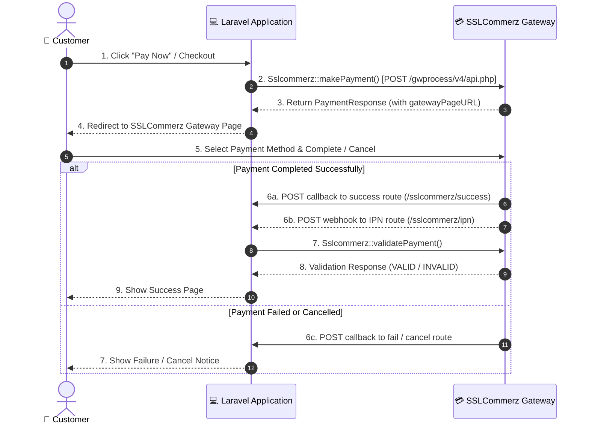

# Basic Usage

This guide covers setting up your callback routes, configuring CSRF exemptions, initiating payments, and handling payment responses.

---

## 🔄 Payment Lifecycle Overview

The standard SSLCommerz payment flow in a Laravel application follows this lifecycle:



---

## 🛣️ Step 1: Defining Callback Routes

SSLCommerz requires callback endpoints to redirect the user after payment completion, failure, or cancellation, as well as an IPN (Instant Payment Notification) endpoint for server-to-server notifications.

Add the following routes to `routes/web.php`:

```php
use App\Http\Controllers\SslcommerzPaymentController;
use Illuminate\Support\Facades\Route;

Route::prefix('sslcommerz')
    ->name('sslc.')
    ->controller(SslcommerzPaymentController::class)
    ->group(function () {
        Route::post('success', 'success')->name('success');
        Route::post('failure', 'failure')->name('failure');
        Route::post('cancel', 'cancel')->name('cancel');
        Route::post('ipn', 'ipn')->name('ipn');
    });
```

> [!NOTE]
> The route names `sslc.success`, `sslc.failure`, `sslc.cancel`, and `sslc.ipn` match the default configuration in `config/sslcommerz.php`. If you change these route names in your configuration, update your route definitions accordingly.

---

## 🛡️ Step 2: Exempt Callback Routes from CSRF Verification

Exempt SSLCommerz callback routes from CSRF verification to prevent `419 Page Expired` errors:

### Laravel 13 (`bootstrap/app.php`)

```php
use Illuminate\Foundation\Application;
use Illuminate\Foundation\Configuration\Middleware;

return Application::configure(basePath: dirname(__DIR__))
    ->withMiddleware(function (Middleware $middleware) {
        $middleware->preventRequestForgery(except: [
            'sslcommerz/*',
        ]);
    })
    ->create();
```

### Laravel 11 & 12 (`bootstrap/app.php`)

```php
use Illuminate\Foundation\Application;
use Illuminate\Foundation\Configuration\Middleware;

return Application::configure(basePath: dirname(__DIR__))
    ->withMiddleware(function (Middleware $middleware) {
        $middleware->validateCsrfTokens(except: [
            'sslcommerz/*',
        ]);
    })
    ->create();
```

### Laravel 10 (`app/Http/Middleware/VerifyCsrfToken.php`)

```php
protected $except = [
    'sslcommerz/*',
];
```

---

## 🚀 Step 3: Initiating a Payment

To initiate a payment, use the `Sslcommerz` facade. Chain the order details, customer details, and shipping information, then call `makePayment()`:

```php
namespace App\Http\Controllers;

use Illuminate\Http\Request;
use Raziul\Sslcommerz\Facades\Sslcommerz;

class SslcommerzPaymentController extends Controller
{
    public function initiatePayment(Request $request)
    {
        // 1. Prepare unique transaction invoice ID and order details
        $invoiceId = 'INV-' . strtoupper(uniqid());
        $totalAmount = 1250.00;
        $productName = 'Wireless Headphones';
        $productCategory = 'Electronics';

        // 2. Initiate payment session
        $response = Sslcommerz::setOrder($totalAmount, $invoiceId, $productName, $productCategory)
            ->setCustomer(
                name: 'John Doe',
                email: 'john.doe@example.com',
                phone: '01711000000',
                address: 'House 12, Road 5, Dhanmondi',
                city: 'Dhaka',
                state: 'Dhaka',
                postal: '1205',
                country: 'Bangladesh'
            )
            ->setShippingInfo(
                quantity: 1,
                address: 'House 12, Road 5, Dhanmondi',
                name: 'John Doe',
                city: 'Dhaka',
                state: 'Dhaka',
                postal: '1205',
                country: 'Bangladesh'
            )
            ->makePayment();

        // 3. Handle response
        if ($response->success()) {
            // Save the pending order with $invoiceId and $response->sessionKey() in your DB
            
            // Redirect customer to SSLCommerz Hosted Payment Page
            return redirect($response->gatewayPageURL());
        }

        // Handle initiation failure
        return back()->with('error', 'Unable to initiate payment: ' . $response->failedReason());
    }
}
```

---

## 📥 Step 4: Handling Callbacks

Implement the callback actions in your controller:

```php
namespace App\Http\Controllers;

use Illuminate\Http\Request;
use Raziul\Sslcommerz\Facades\Sslcommerz;
use App\Models\Order;

class SslcommerzPaymentController extends Controller
{
    /**
     * Handle payment success callback from customer redirect.
     */
    public function success(Request $request)
    {
        $tranId = $request->input('tran_id');
        $valId = $request->input('val_id');
        $amount = (float) $request->input('amount');
        $currency = $request->input('currency', 'BDT');

        // Look up the order in your database
        $order = Order::where('transaction_id', $tranId)->first();

        if (! $order) {
            return redirect()->route('orders.index')->with('error', 'Order not found.');
        }

        // Validate payment with SSLCommerz server
        $isValid = Sslcommerz::validatePayment($request->all(), $tranId, $order->amount, $currency);

        if ($isValid) {
            // Update order status if not already completed (prevents double update from IPN)
            if ($order->status !== 'completed') {
                $order->update([
                    'status' => 'completed',
                    'bank_tran_id' => $request->input('bank_tran_id'),
                    'val_id' => $valId,
                    'card_type' => $request->input('card_type'),
                ]);
            }

            return redirect()->route('orders.show', $order->id)->with('success', 'Payment completed successfully!');
        }

        return redirect()->route('orders.show', $order->id)->with('error', 'Payment validation failed.');
    }

    /**
     * Handle payment failure callback.
     */
    public function failure(Request $request)
    {
        $tranId = $request->input('tran_id');
        $order = Order::where('transaction_id', $tranId)->first();

        if ($order && $order->status === 'pending') {
            $order->update(['status' => 'failed']);
        }

        return redirect()->route('checkout')->with('error', 'Payment failed! Reason: ' . $request->input('error', 'Unknown'));
    }

    /**
     * Handle payment cancellation callback.
     */
    public function cancel(Request $request)
    {
        $tranId = $request->input('tran_id');
        $order = Order::where('transaction_id', $tranId)->first();

        if ($order && $order->status === 'pending') {
            $order->update(['status' => 'cancelled']);
        }

        return redirect()->route('checkout')->with('warning', 'You have cancelled the payment.');
    }

    /**
     * Handle Instant Payment Notification (IPN).
     * Server-to-server webhook from SSLCommerz.
     */
    public function ipn(Request $request)
    {
        $tranId = $request->input('tran_id');
        $valId = $request->input('val_id');

        if (empty($tranId) || empty($valId)) {
            return response()->json(['message' => 'Invalid IPN payload'], 400);
        }

        $order = Order::where('transaction_id', $tranId)->first();

        if (! $order) {
            return response()->json(['message' => 'Order not found'], 404);
        }

        // Validate hash and payment
        if (Sslcommerz::verifyHash($request->all()) && Sslcommerz::validatePayment($request->all(), $tranId, $order->amount, $order->currency)) {
            if ($order->status !== 'completed') {
                $order->update([
                    'status' => 'completed',
                    'bank_tran_id' => $request->input('bank_tran_id'),
                    'val_id' => $valId,
                    'card_type' => $request->input('card_type'),
                ]);
            }

            return response()->json(['message' => 'IPN processed successfully']);
        }

        return response()->json(['message' => 'IPN verification failed'], 400);
    }
}
```

---

## ⏭️ Next Steps

- Learn about security and hash verification in [Validation & Security](03-validation-and-security.md).
- Learn how to issue full or partial refunds in [Refunds](04-refunds.md).
